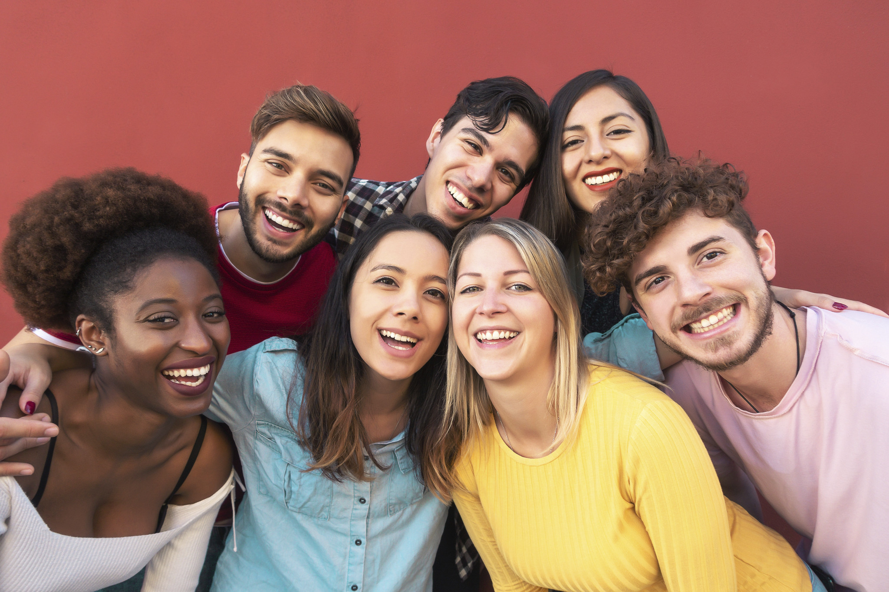
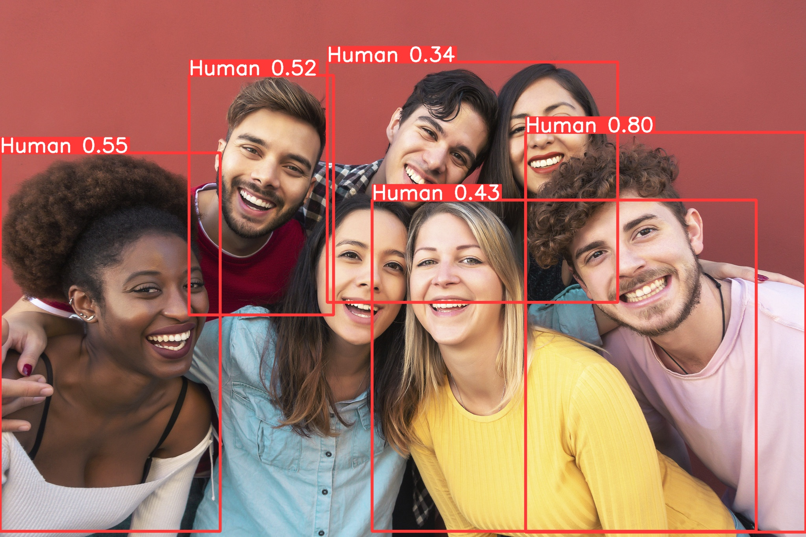

# YOLOv8-Object-Detection

## Part I: Introduction

Object Detection is a computer vision task that involves building a program capable of returning the coordinates (bounding box) and class names of objects present in an image that we want to detect.


**Figure 1:** Input/Output of Object Detection task with the desired objects being Dog and Cat.

 

**(a) Input Image** (b) YOLOv8 Detection Results

**Figure 2:** Illustrative example of the results of the Human Detection program using YOLOv8.

This project implements a Python program for Human Detection in an image using the YOLOv8 algorithm.

## Part II: Program Installation

To install and use the YOLOv8 algorithm, follow these instructions:

1. **Download YOLOv8 Source Code from GitHub**: To use YOLOv8, we need to download the source code from the YOLOv8 GitHub repository. The YOLOv8 source code is publicly available on GitHub. Follow these steps:
   - Step 1: Access the YOLOv8 GitHub repository [here](https://github.com/ultralytics/ultralytics). If successful, you will see the interface as shown below:

   

   **Figure 8:** YOLOv8 GitHub interface

   - Step 2: On the YOLOv8 GitHub page, click on the "Code" tab (highlighted in blue as shown below) and select the "Copy" button to copy the repository link:

   

   **Figure 9:** Copy the repository link to download YOLOv8 source code

   - Step 3: Go back to Google Colab and create a code cell using the command: `!git clone <link>` (replace `<link>` with the copied GitHub repository link from step 2). If the code cell executes successfully, you will see the following result:

   

   **Figure 10:** Clone YOLOv8 source code using git clone command

   To verify, you can refresh the Files section of Google Colab to check if the YOLOv8 folder has appeared.

   

   **Figure 11:** YOLOv8 folder

2. **Install Required Python Libraries**: The YOLOv8 source code is built using several Python libraries. To run YOLOv8, we need to install the required libraries. YOLOv8 provides built-in support for a library called "ultralytics," which can be installed using the pip command:

   

   **Figure 12:** Install the ultralytics library using pip command

   Alternatively, you can also install the required libraries using the setup file provided in the YOLOv8 source code:

   

   **Figure 13:** Install required libraries using the setup file
3. **Download Pretrained Model**: Download the pretrained model file from [here](https://github.com/ultralytics/assets/releases/download/v0.0.0/yolov8s.pt) and place the downloaded file in the ./ultralytics directory. On Google Colab, you can use the `wget` command as shown below:

   

   **Figure 14:** Download pretrained model using the `wget` command

   To verify if the pretrained model file has been successfully downloaded, refresh the Files section of Google Colab and look for a file named YOLOv8s.pt:

   

   **Figure 15:** Pretrained model file

4. **Prepare the Data**: To train YOLOv8 on any dataset, you need two main components:
   - Data directory: Prepare a directory that contains the dataset. The directory structure should be organized as follows:

     

     **Figure 16:** Dataset folder structure in YOLOv8

     Where:
       - The `images` directory contains image files (.jpg, .png, etc.).
       - The `labels` directory contains corresponding .txt files for each image (with the same file name as the images).
       - The `data.yaml` file: Detailed content will be discussed in the next section.

     Download the human dataset from [here](https://drive.google.com/u/0/uc?id=1--0QuKMwj31K-CSvD8oq5fceFweiFPuN&export=download). You can manually download the .zip file or use the following commands to download and extract it automatically:

     ```python
     !gdown https://drive.google.com/u/0/uc?id=1--0QuKMwj31K -CSvD8oq5fceFweiFPuN& export=download
     !unzip /content/human\_detection\_dataset.zip
     ```

   - The .yaml file: Prepare a .yaml file that contains information about the dataset mentioned above. You can refer to some example .yaml files provided by the YOLOv8 author:

     

     **Figure 17:** Important fields in the .yaml file

     For the human dataset, you need to create a new .yaml file (e.g., data.yaml) and fill in the corresponding information (the provided dataset folder structure). You can do this manually or use the following code to create it automatically. Note that the .yaml file should be placed inside the human_detection_dataset folder:

     ```python
     import yaml

     dataset_info = {
       'train': './train/images',
       'val': './val/images',
       'nc': 1,
       'names': ['Human']
     }

     with open('./human_detection_dataset/data.yaml', 'w+') as f:
       doc = yaml.dump(dataset_info, f, default_flow_style=None, sort_keys=False)
     ```

     Each dataset may have different information, so you need to adjust it according to your dataset (number of classes, class names, data directory paths, etc.).

5. **Perform Training**: After completing the preparation steps, you can start the training process with the prepared dataset. Execute the following command (replace the data.yaml file name if using a different dataset):

   ```python
   !yolo train model=yolov8s.pt data=./human_detection_dataset/data.yaml epochs=20 imgsz=640
   ```
   After completing the training process, you will see the output displayed on the screen as shown in the following illustration:

   

   **Figure 18:** Output displayed after completing the training process

   Check the ./runs directory, and you will find a ./detect/train file. This file contains the output of YOLOv8.

   

   **Figure 19:** The train directory
6. **Performing Detection (Prediction) with Trained Model**

   To use the trained model on any arbitrary image, use the following command:

   ```python
   # With uploaded image
   !yolo predict model=<weight_path> source=<image_path>
   ```
   Where:
   - `<weight_path>`: Path to the weight file of the trained model. You can find it in the output displayed after the YOLOv8 training process (refer to Figure 20 below).

   

   Figure 20: Path to the weight file of the trained model. Note: Choose the best.pt file.

   - `<image_path>`: Path to the input image file.

   The following is an illustrated result after executing the above code:

   

   In addition to the image source, you can also input different data types as represented by the different parameters:

   

   Figure 21: Overview of different input data types supported by YOLOv8 for prediction
   
   Predict on sample.jpg => sameple_predict.jpg
    
   
   Predict on URL [link](https://www.youtube.com/watch?v=MsXdUtlDVhk)
   Result: https://youtu.be/B8HJfROv_jM

   This step concludes the tutorial on using YOLOv8. For the project's objective, you only need to apply the provided instructions for the human data (with    some necessary modifications) and proceed to step 7.
7. **OPTIONAL**: This section will discuss some additional aspects of YOLOv8, including parameters in the training command, model evaluation, and data labeling.

- **Parameters in the training command**: The training command in step 6 has default parameters, which you can customize according to your preferences. Different parameter values will yield different model performances. Here are the basic meanings of some parameters:

	- `img`: The size of the training image. The training and testing images will be resized to the specified size, which is set to 640 by default. You can experiment with different image sizes.

	- `batch`: During the training process, models can either read the entire training data at once or read it in batches. The default value is 64, which means the training dataset will be divided into batches of 64 samples. You can set different values as 2n (n ≥ 0).

	- `epochs`: The number of times the training process iterates over the dataset.

	- `data`: Information about the training dataset in a .yaml file.

	- `weights`: The pretrained model file to be used. You can download and use different pretrained model files from this [list](https://docs.ultralytics.com/tasks/detect/#models).

- **Model evaluation**: As mentioned before, the performance of the model can vary with different parameter values. To quantitatively evaluate the models and find the best-performing one, you can execute the following command:


Figure 22: Evaluation results on the validation set


